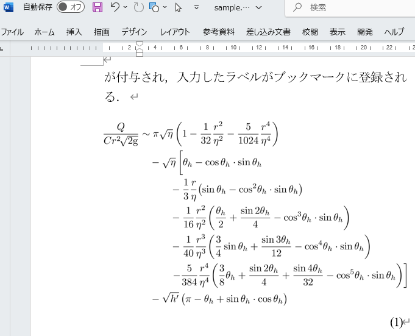
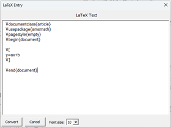
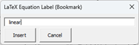

# latex_in_word_mod

## 概　要 

&emsp;sample.docm は $\LaTeX$ で粗飯した数式の画像ファイルを Microsoft Word の文書の Shape オブジェクトに変換して文中に挿入する機能を実装したマクロ有効文書ファイルである．  
&emsp;このマクロは EngineeroLabs の Engineero Nathan が GPL ライセンスで公開している git リポジトリ [latex_in_word](https://github.com/EngineeroLabs/latex_in_word) 内に含まれている latex_in_word_2010.docm を編集して，サーバーとの交信で取得している数式の画像ファイルを Yusuke Terada and Noriyuki Abe が開発した [Tex2img](https://tex2img.tech/)  で生成されるそれに変更している． 
 

    

## 事前準備 
 
### $\LaTeX$ 関連

&emsp;以下が必要である．

* W32TeX，TeX Live 等がインストール済みで $\LaTeX$  の実行環境が整っていること
* 第 9 版以降の Gostscrupt がインストールされていること
 
### Tex2img のインストール

&emsp;Tex2img をインストールする． 
sample.docm の初回起動時に限り teximgc.exe の登録先を指定するダイヤログが表示される． 
 
### 実行方法 
 
#### 数式の入力 

&emsp;新規の入力の場合はカーソルで **Alt+l** をタイプすると下図の画面が表示される．
\\[.*\\] の部分を所望のスクリ
プトに変更して Convert ボタンをクリックするとコマンドプロンプトで teximgc.exe  が呼び出され生成したイメージが画面に表示される． 
&emsp;また既存のイメージを選択して同様の操作を行うと入力時のスクリプトが再表示されるので必要があれば修正してイメージを再生成する．
&emsp;スクリプトはコピーしたイメージにも継承されるので一部変更する場合に有用である．

    

 
##### 数式番号の入力 

&emsp;数式番号を入力する行にルーラー（∟）を設けて tab をタイプしてカーソルを移動したうえで **Alt+n** をタイプすると下図の画面が表示される．
適当なラベルを入力して Insert ボタンをクリックすると，式番号が付与されブックマークに登録される．
この行以前に数式を新規入力した場合には式番号が更新される． 
 

    

### 新規／既存の docm への組み込み

&emsp;sample.docm 以外のファイルにマクロを組み込む場合は以下のように操作する．

1. 「開発」→「Visual Basic」で表示される「Visual Basic for Application」のプロジェクトに LaTeXMacros.bas と *.cls をインポート
1. ThisDocument.cls の内容を ThisDocument にコピー
1. 「ファイル」→「オプション」→「リボンのユーザー設定」→「ユーザー設定」→分類を「マクロ」に→プロジェクトの「保存先」を選択，と操作して以下のショートカットを割り当てる．
    * LaTeXEntry　Alt-l
    * EqnNumber　Alt-n
1. tex2imgc の登録先をカスタム属性に加えるため一旦保存して再起動

### docx 形式への変換 
 
&emsp;「ファイル」→「名前を付けて保存」で保存形式を docx に変更して表示されるアラートに「はい」で応答するとマクロを機能させないファイルが生成される．
マクロ自体はそのまま保存されるので必要があれば削除しておく．  